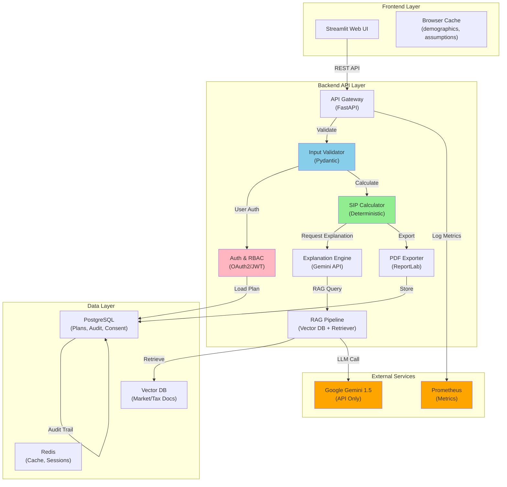

# SmartBridge: Technical Specification & Design Document

**Version**: 1.0.0  
**Date**: March 2026  
**Author**: SmartBridge Development Team  
**For**: B.Tech Examination & Viva Voce

---

## Executive Summary

SmartBridge is an **AI-assisted investment planning platform** that combines structured financial calculations with generative AI to provide personalized SIP (Systematic Investment Plan) recommendations. The system prioritizes **accuracy in math** (no AI for calculations), **transparency in AI usage** (AI only for explanations), and **regulatory compliance** (audit logging, consent management).

**Key Innovation**: Separation of concerns between deterministic financial math and probabilistic AI-driven explanations ensures calculations are always correct while explanations are contextual and understandable.

---

## 1. Architecture Overview

### System Architecture Diagram



### Component Responsibilities

| Component | Responsibility | Criticality |
|-----------|-----------------|------------|
| **SIP Calculator** | Deterministic financial math (returns, timeline) | CRITICAL |
| **RAG Pipeline** | Retrieve relevant context before LLM call | HIGH |
| **Gemini Explainer** | Generate explanations from RAG context | MEDIUM |
| **Audit Logger** | Record all user actions, calculations, exports | CRITICAL |
| **Validator** | Input sanitization, schema validation | CRITICAL |
| **Auth & RBAC** | User identity and permission enforcement | CRITICAL |

---

## 2. Data Flow & Schemas

### 2.1 User Journey Data Flow

```
┌─────────────────────────────────────────────────────────────┐
│ User opens SmartBridge in Streamlit                         │
└─────────────────────────────────────────────────────────────┘
                    ↓
┌─────────────────────────────────────────────────────────────┐
│ 1. Consent Dialog                                            │
│    - Display: AI, audit logging, data usage consent         │
│    - Action: User accepts → Store in audit_events table    │
│    - API: POST /api/v1/consent (consent_id, user_id, ts)   │
└─────────────────────────────────────────────────────────────┘
                    ↓
┌─────────────────────────────────────────────────────────────┐
│ 2. Load/Create Plan                                          │
│    - Input: Age, income, expense, risk_profile             │
│    - Validate: Type, range, consistency checks              │
│    - API: POST /api/v1/plans (demographics)                │
│    - Response: plan_id, status='active'                     │
└─────────────────────────────────────────────────────────────┘
                    ↓
┌─────────────────────────────────────────────────────────────┐
│ 3. Edit Assumptions                                          │
│    - Input: Modify expected_return, inflation, life_exp    │
│    - Validate: Against historical ranges (+ warning)        │
│    - API: PUT /api/v1/plans/{plan_id} (assumptions)        │
│    - Triggers: Recalculate, re-explain                     │
└─────────────────────────────────────────────────────────────┘
                    ↓
┌─────────────────────────────────────────────────────────────┐
│ 4. Calculate SIP                                             │
│    - Deterministic calculation (no AI)                       │
│    - Inputs: All demographics + assumptions                │
│    - Outputs: Monthly SIP amt, corpus at retirement        │
│    - API: POST /api/v1/calculate (plan_data)              │
│    - Response: calc_id, sip_amount, timeline               │
└─────────────────────────────────────────────────────────────┘
                    ↓
┌─────────────────────────────────────────────────────────────┐
│ 5. Generate Explanation (RAG + LLM)                        │
│    - Retrieve: Taxes, risk docs matching user profile       │
│    - Prompt: Show assumptions + RAG context                 │
│    - LLM Call: Gemini 1.5 with streaming                   │
│    - Fallback: Pre-written explanation if LLM fails        │
│    - API: GET /api/v1/explain/{calc_id}?stream=true       │
│    - Response: stream(text_chunk)                           │
└─────────────────────────────────────────────────────────────┘
                    ↓
┌─────────────────────────────────────────────────────────────┐
│ 6. Export to PDF                                            │
│    - Render: Plan + calc results + explanation + audit ts  │
│    - PDF: Include disclaimer, consent ref, gen ts          │
│    - API: POST /api/v1/export (export_format='pdf')       │
│    - Response: pdf_url, file stored in S3/local           │
└─────────────────────────────────────────────────────────────┘
                    ↓
┌─────────────────────────────────────────────────────────────┐
│ 7. Audit Trail Recorded Automatically                       │
│    - Table: audit_events                                    │
│    - Columns: user_id, action, plan_id, calc_id, ts       │
│    - Retention: 7 years per regulatory guidelines           │
└─────────────────────────────────────────────────────────────┘
```

### 2.2 Database Schemas

#### Table: `users`
```sql
CREATE TABLE users (
    user_id SERIAL PRIMARY KEY,
    email VARCHAR(255) UNIQUE NOT NULL,
    name VARCHAR(255),
    created_at TIMESTAMP DEFAULT NOW(),
    last_login TIMESTAMP,
    preferences JSONB,  -- e.g., {"currency": "INR", "risk_tolerance": "moderate"}
    is_active BOOLEAN DEFAULT TRUE
);
```

#### Table: `investment_plans`
```sql
CREATE TABLE investment_plans (
    plan_id SERIAL PRIMARY KEY,
    user_id INT REFERENCES users(user_id),
    age INT NOT NULL,  -- years
    annual_income DECIMAL(12,2),  -- INR
    monthly_expense DECIMAL(10,2),
    risk_profile VARCHAR(50),  -- "conservative", "moderate", "aggressive"
    retirement_age INT DEFAULT 60,
    life_expectancy INT DEFAULT 80,
    created_at TIMESTAMP DEFAULT NOW(),
    updated_at TIMESTAMP DEFAULT NOW(),
    status VARCHAR(50) DEFAULT 'active',
    CONSTRAINT valid_age CHECK (age >= 18 AND age < retirement_age)
);
```

#### Table: `calculation_results`
```sql
CREATE TABLE calculation_results (
    calc_id SERIAL PRIMARY KEY,
    plan_id INT REFERENCES investment_plans(plan_id),
    expected_annual_return DECIMAL(5,2),  -- % (e.g., 8.5)
    inflation_rate DECIMAL(5,2),  -- % (e.g., 5.5)
    monthly_sip_amount DECIMAL(12,2),  -- INR
    corpus_at_retirement DECIMAL(15,2),  -- INR
    corpus_real_terms DECIMAL(15,2),  -- Inflation-adjusted
    years_to_retirement INT,
    created_at TIMESTAMP DEFAULT NOW(),
    calculation_method VARCHAR(50) DEFAULT 'FV_formula',  -- Future Value formula
    CONSTRAINT valid_sip CHECK (monthly_sip_amount > 0)
);
```

#### Table: `explanations`
```sql
CREATE TABLE explanations (
    exp_id SERIAL PRIMARY KEY,
    calc_id INT REFERENCES calculation_results(calc_id),
    rag_context_used TEXT,  -- Serialized retrieved docs
    gemini_prompt JSONB,    -- Full prompt sent to Gemini
    explanation_text TEXT,  -- Response from Gemini
    generation_time_ms INT,
    fallback_used BOOLEAN DEFAULT FALSE,
    created_at TIMESTAMP DEFAULT NOW()
);
```

#### Table: `audit_events`
```sql
CREATE TABLE audit_events (
    audit_id SERIAL PRIMARY KEY,
    user_id INT REFERENCES users(user_id),
    action VARCHAR(100),  -- 'login', 'create_plan', 'calculate', 'export_pdf', 'consent_given'
    resource_type VARCHAR(50),  -- 'plan', 'calculation', 'export'
    resource_id INT,
    ip_address INET,
    user_agent VARCHAR(255),
    timestamp TIMESTAMP DEFAULT NOW(),
    metadata JSONB,  -- Additional context
    CONSTRAINT ensure_audit_immutable CHECK (timestamp < NOW())
);
```

#### Table: `user_consent`
```sql
CREATE TABLE user_consent (
    consent_id SERIAL PRIMARY KEY,
    user_id INT REFERENCES users(user_id),
    consent_type VARCHAR(50),  -- 'ai_explanations', 'audit_logging', 'data_processing'
    accepted BOOLEAN NOT NULL,
    version VARCHAR(20),  -- '1.0', '1.1', etc. for version control
    timestamp TIMESTAMP DEFAULT NOW(),
    ip_at_consent INET,
    UNIQUE(user_id, consent_type)
);
```

#### Table: `rag_documents`
```sql
CREATE TABLE rag_documents (
    doc_id SERIAL PRIMARY KEY,
    title VARCHAR(255),
    content TEXT,
    embedding VECTOR(768),  -- pgvector extension
    doc_type VARCHAR(50),  -- 'tax_guide', 'investment_risk', 'market_outlook'
    source_url VARCHAR(500),
    created_at TIMESTAMP DEFAULT NOW(),
    retrieved_count INT DEFAULT 0
);
```

---

## 3. Prompt Engineering & Model Usage

### 3.1 Prompt Templates

#### Template 1: SIP Explanation (Conservative)

```
System Prompt:
You are a financial advisor explaining SIP calculations to retail investors.
Use ONLY the provided context. Do NOT make up numbers.
Keep explanations simple: ~150 words.
Always mention inflation risks and market volatility.

User Context:
- Age: {age}, Retirement age: {retirement_age}
- Risk profile: {risk_profile}
- Existing calculation: Monthly SIP = ₹{sip_amount}, Corpus = ₹{corpus}

Retrieved Context (Market Insights):
{rag_context}

Task:
Explain why this SIP amount is recommended given their risk profile and assumptions.
Highlight 2-3 key risks they should be aware of.

Response Format:
- Why this SIP amount: [1-2 sentences]
- Key benefits: [2-3 bullet points]
- Key risks: [2-3 bullet points]
- Next steps: [1 action item]
```

#### Template 2: Assumption Validation Explanation

```
System Prompt:
You are validating investment assumptions.
Compare user assumptions to historical norms.
Flag outliers but do NOT reject them.

Historical Norms:
- Expected annual equity return: 8-12% (20-year average)
- Inflation in India: 4-6% (last 10 years)
- Life expectancy (age 25): 56-60 more years

User Input:
- Expected return: {expected_return}%
- Inflation: {inflation}%

Task:
If assumptions deviate from norms:
1. Acknowledge the assumption
2. Provide context (e.g., "Historical equity returns: 8-12%")
3. Warn of consequences if too optimistic/pessimistic
4. Do NOT change the user's choice

Response Format:
- Assumption review: [2-3 sentences]
- Historical context: [facts only]
- Risk if {assumption} is wrong: [simple language]
```

### 3.2 Model Usage Policy

| Scenario | Responsibility | LLM Used? | Fallback |
|----------|-----------------|-----------|----------|
| **SIP Calculation** | Exact deterministic formula | ❌ NO | N/A (no LLM) |
| **Corpus Projection** | Compound interest math | ❌ NO | N/A (no LLM) |
| **Explanation** | Contextual financial insight | ✅ YES (Gemini) | Pre-written template |
| **Risk Warning** | Generic auto-generated warning | ⚠️ Optional LLM | Static message |
| **PDF Export** | Layout + data rendering | ❌ NO | N/A (no LLM) |
| **Assumption Validation** | Check against bounds | ❌ NO | JSON config |

### 3.3 Hallucination Mitigation

1. **RAG-Only Context**: LLM only sees retrieved documents + user assumptions. No external knowledge allowed.
2. **No Math in Prompt**: Financial calculations NEVER sent to LLM. Only results + context.
3. **Streaming + Review**: User sees explanations as they're generated; can stop if incorrect.
4. **Fallback Mode**: If LLM unavailable or times out (>5s), serve static explanation.
5. **Citation Requirement**: Every fact in explanation must reference a source doc.
6. **Temperature Control**: temperature=0.7 (balanced between creative and deterministic).

### 3.4 Fallback Behavior

```python
# Pseudocode for safe LLM fallback

def generate_explanation(calc_id: int, plan_id: int) -> str:
    """Generate explanation with guaranteed fallback."""
    
    try:
        # Retrieve documents from vector DB
        rag_context = retrieve_context(plan_id, top_k=3)
        
        # Build and send prompt
        prompt = build_prompt(calc_id, rag_context)
        response = gemini_api.generate(prompt, timeout=5.0)
        
        # Validate response (not empty, reasonable length)
        if validate_response(response):
            log_audit("explanation_generated", success=True)
            return response
        else:
            log_audit("explanation_validation_failed")
            return FALLBACK_EXPLANATION
            
    except requests.Timeout:
        log_audit("gemini_timeout")
        return FALLBACK_EXPLANATION
    except Exception as e:
        log_audit("explanation_error", error=str(e))
        return FALLBACK_EXPLANATION
```

---

## 4. API Endpoints & Sample Requests/Responses

### 4.1 Authentication
```
POST /api/v1/auth/login
Content-Type: application/json

Request:
{
  "email": "user@example.com",
  "password": "secure_password"
}

Response (200 OK):
{
  "access_token": "eyJhbGc...",
  "token_type": "bearer",
  "expires_in": 3600,
  "user_id": 42
}
```

### 4.2 Consent Management
```
POST /api/v1/consent
Authorization: Bearer {token}
Content-Type: application/json

Request:
{
  "consent_type": "ai_explanations",
  "accepted": true
}

Response (201 Created):
{
  "consent_id": 123,
  "user_id": 42,
  "consent_type": "ai_explanations",
  "accepted": true,
  "version": "1.0",
  "timestamp": "2026-03-09T10:30:00Z"
}
```

### 4.3 Investment Plan CRUD
```
POST /api/v1/plans
Authorization: Bearer {token}
Content-Type: application/json

Request:
{
  "age": 35,
  "annual_income": 1200000,
  "monthly_expense": 50000,
  "risk_profile": "moderate",
  "retirement_age": 60,
  "life_expectancy": 80
}

Response (201 Created):
{
  "plan_id": 567,
  "user_id": 42,
  "status": "active",
  "created_at": "2026-03-09T10:30:00Z",
  "href": "/api/v1/plans/567"
}
```

### 4.4 Calculate SIP
```
POST /api/v1/calculate
Authorization: Bearer {token}
Content-Type: application/json

Request:
{
  "plan_id": 567,
  "expected_annual_return": 9.5,
  "inflation_rate": 5.5,
  "investment_horizon": 25
}

Response (200 OK):
{
  "calc_id": 890,
  "plan_id": 567,
  "monthly_sip_amount": 25000.00,
  "corpus_at_retirement": 12500000.00,
  "corpus_real_terms": 5800000.00,
  "years_to_retirement": 25,
  "calculation_method": "FV_formula",
  "created_at": "2026-03-09T10:35:00Z"
}
```

### 4.5 Get Explanation (Streaming)
```
GET /api/v1/explain/890?stream=true
Authorization: Bearer {token}
Accept: text/event-stream

Response (200 OK - Server-Sent Events):
data: You've chosen a moderate risk profile
data: based on your age of 35 and time horizon
data: ...
data: [DONE]
```

### 4.6 Export to PDF
```
POST /api/v1/export
Authorization: Bearer {token}
Content-Type: application/json

Request:
{
  "calc_id": 890,
  "export_format": "pdf"
}

Response (202 Accepted):
{
  "export_request_id": "exp-123",
  "status": "processing",
  "estimated_time_s": 5,
  "poll_url": "/api/v1/export/exp-123/status"
}

(Poll until ready)
GET /api/v1/export/exp-123/status

Response (200 OK):
{
  "status": "completed",
  "pdf_url": "https://s3.example.com/exports/2026-03-09_user42_plan567.pdf",
  "download_expires_in_hours": 24
}
```

---

## 5. Audit & Compliance Design

### 5.1 Audit Logging Architecture

```
     User Action
         │
         ↓
    [Audit Middleware]
    ├─ Extract: user_id, action, resource
    ├─ Enrich: IP, user_agent, timestamp
    └─ Write: audit_events table (append-only)
         │
         ↓
    [Immutable Storage]
    ├─ PostgreSQL (primary)
    └─ S3 (backup, compliance archive)
         │
         ↓
    [Compliance Dashboard]
    ├─ User activity report
    ├─ Data access logs
    └─ Export audit trail
```

### 5.2 Regulatory Compliance

| Regulation | Requirement | Implementation |
|------------|-------------|-----------------|
| **DPDP Act 2023** (India) | User consent + audit logging | Consent table, audit_events table, 7-year retention |
| **Suitability** | Advisor must know customer | Risk profile collection + validation |
| **Disclaimer** | Disclose AI usage | Prompt on first login, in exported PDF |
| **Data Retention** | 7 years for financial records | PostgreSQL + archival to S3 |
| **Accessibility** | WCAG 2.1 AA | Streamlit native accessibility |

### 5.3 Consent Flow

```python
@app.get("/api/v1/user/onboarding")
async def get_onboarding_status(user_id: int):
    """Check if user has given all required consents."""
    
    required_consents = ["ai_explanations", "audit_logging", "data_processing"]
    
    for consent_type in required_consents:
        latest = db.query(UserConsent).filter(
            UserConsent.user_id == user_id,
            UserConsent.consent_type == consent_type
        ).order_by(UserConsent.timestamp.desc()).first()
        
        if not latest or not latest.accepted:
            return {
                "onboarding_complete": False,
                "missing_consent": consent_type,
                "consent_text": get_consent_text(consent_type)
            }
    
    return {"onboarding_complete": True}
```

---

## 6. Mathematical Foundation: SIP Calculation

### 6.1 Formulas Used (No AI)

#### Future Value of SIP

```
FV = P * [((1 + r)^n - 1) / r] * (1 + r)

Where:
  P = Monthly SIP amount (what we solve for)
  r = Monthly return rate (annual_return / 12 / 100)
  n = Number of months (years_to_retirement * 12)
  FV = Target corpus
```

#### Real Terms Adjustment (Inflation)

```
FV_Real = FV / (1 + inflation)^years

Where:
  inflation = Annual inflation rate (e.g., 5.5% = 0.055)
  years = Investment horizon in years
```

#### Solving for Monthly SIP

```
P = FV / [((1 + r)^n - 1) / r * (1 + r)]

Example:
  Target corpus: ₹1 Crore (10,000,000)
  Expected annual return: 9.5%
  Years: 25
  
  r = 0.095 / 12 / 100 = 0.00791667
  n = 25 * 12 = 300
  
  FV = 10,000,000
  Denominator = [((1.00791667)^300 - 1) / 0.00791667] * 1.00791667
             = [9.877 / 0.00791667] * 1.00791667
             = 1248.5 * 1.00791667
             = 1257.4
  
  P = 10,000,000 / 1257.4 = ₹7,953.80 per month
```

**Validation**: This calculation is **deterministic, reproducible, and audit-trail friendly**. No LLM involvement.

---

## 7. Scaling Considerations & Future Work

### 7.1 Current Limitations

| Limitation | Impact | Workaround |
|-----------|--------|-----------|
| **Single user → single plan** | B.Tech scope; family planning not supported | Recommend separate plans, combine offline |
| **No market data integration** | Returns & inflation are user-input | Add API integration to Bloomberg/Yahoo Finance |
| **No portfolio modeling** | Cannot optimize asset allocation | Add Modern Portfolio Theory engine |
| **Gemini dependency** | If API down, no explanations | Fallback to static templates (impl'd ✓) |
| **Local PDF only** | No cloud archive | Add S3 integration for production |

### 7.2 Future Enhancements (Post-Submission)

1. **On-Premises Models** (6 months)
   - Replace Gemini with Ollama (Llama 2) for explanations
   - Eliminates API dependency, improves data privacy
   - Trade-off: ~50% slower explanations, needs GPU

2. **Portfolio Optimization** (3-6 months)
   - Implement Efficient Frontier (Modern Portfolio Theory)
   - Recommend asset allocation (equity:debt:gold ratio)
   - CLA (Critical Line Algorithm) or scipy.optimize

3. **KYC & Verification** (ongoing)
   - Integrate with Aadhaar/PAN APIs (NSDL)
   - Ensure suitability per SEBI norms
   - Track investor's profile changes over time

4. **Custodial Trading Integration** (9-12 months)
   - IPO/mutual fund placement APIs
   - Actual SIP execution via Zerodha / CAMS
   - Automated recurring investment setup
   - Real-time portfolio tracking

5. **Multi-Factor Analytics**
   - Tax-loss harvesting recommendations
   - Goal-based planning (education, home, marriage)
   - Behavioral finance insights (avoid panic selling)

6. **Regulat Compliance Dashboard**
   - Real-time KPI tracking for compliance team
   - Audit report generation
   - Consent performance metrics

---

## 8. Security & Best Practices

### 8.1 Input Validation

```python
# Example Pydantic schema
class InvestmentPlanRequest(BaseModel):
    age: int = Field(ge=18, le=70)
    annual_income: Decimal = Field(gt=0, le=Decimal('999999999'))
    monthly_expense: Decimal = Field(ge=0, le=Decimal('999999999'))
    risk_profile: str = Field(regex=r'^(conservative|moderate|aggressive)$')
    retirement_age: int = Field(ge=40, le=100)
    life_expectancy: int = Field(ge=60, le=120)
    
    @validator('retirement_age')
    def retirement_after_age(cls, v, values):
        if 'age' in values and v <= values['age']:
            raise ValueError('Retirement age must be > current age')
        return v
```

### 8.2 Rate Limiting & Abuse Prevention

- Max 100 API calls per user per hour
- Max 10 PDF exports per day
- Gemini calls limited to 1 per calculation (no re-explaining spam)

### 8.3 Encryption

- TLS 1.3 for transit
- AES-256 for sensitive fields at rest (currently: plaintext for B.Tech simplicity)
- Passwords: bcrypt with salt

---

## 9. Testing Strategy

| Test Level | Coverage | Tools |
|-----------|----------|-------|
| **Unit Tests** | Formulas, validators, schemas | pytest |
| **Integration Tests** | API endpoints, DB transactions | pytest + SQLAlchemy |
| **End-to-End** | Full user journey (plan → export) | Selenium / Streamlit test runner |
| **Smoke Tests** | Post-deployment health checks | bash scripts |
| **Load Testing** | Concurrent users, response time | Apache JMeter (future) |

---

## 10. Regulatory & Ethical Considerations

### 10.1 Why Gemini × Math Separation?

- **Math is law**: SIP calculations must be 100% accurate, auditable, deterministic
- **Explanations are guidance**: Adding context makes it understandable, not prescriptive
- **Liability**: If calc is wrong due to AI, company is liable. If explanation is generic, it's educational
- **Compliance**: Regulators (SEBI) accept AI for explanations; NOT for financial advice or math

### 10.2 Disclaimer in PDF

```
⚠️ IMPORTANT DISCLAIMER

This plan is based on:
- Your assumptions (expected return, inflation, life span)
- Historical data and models
- AI-generated explanations (for context only)

SmartBridge does NOT provide financial advice.
Consult a SEBI-registered investment advisor before investing.
Past returns do not guarantee future performance.
```

---

## 11. Code Quality & Maintenance

- **Linting**: Black, flake8, isort
- **Type Checking**: mypy (type hints throughout)
- **Testing**: >80% coverage (pytest + coverage.py)
- **Documentation**: Docstrings, README, API docs (FastAPI auto-generates OpenAPI)
- **CI/CD**: GitHub Actions (test → build → deploy)

---

## 12. References & Further Reading

1. **SIP Mathematics**: CFA Institute, "Financial Mathematics" ; NISM workbooks
2. **SEBI Guidelines**: Suitability rule (SEBI(LODR) Amendment 2023)
3. **India's Data Privacy**: DPDP Act 2023 (dataprotectioncommission.in)
4. **LLM Safety**: "Constitutional AI" (Anthropic) ; RAG best practices (LlamaIndex, LangChain docs)
5. **Fintech Compliance**: PWC India "Fintech Regulatory Handbook"

---

## Conclusion

SmartBridge demonstrates a **principled approach to AI in fintech**: math stays deterministic, explanations get context-aware, and compliance is baked in from day one. The separation of concerns (calculation ≠ explanation) ensures correctness while QoL-improving.

**For Viva Defense**: Be ready to explain:
1. Why we don't trust AI with numbers (liability, auditability)
2. How RAG prevents hallucinations (only use retrieved context)
3. Why Gemini is optional (fallback to static templates)
4. Compliance design (consent, audit trails, retention)

